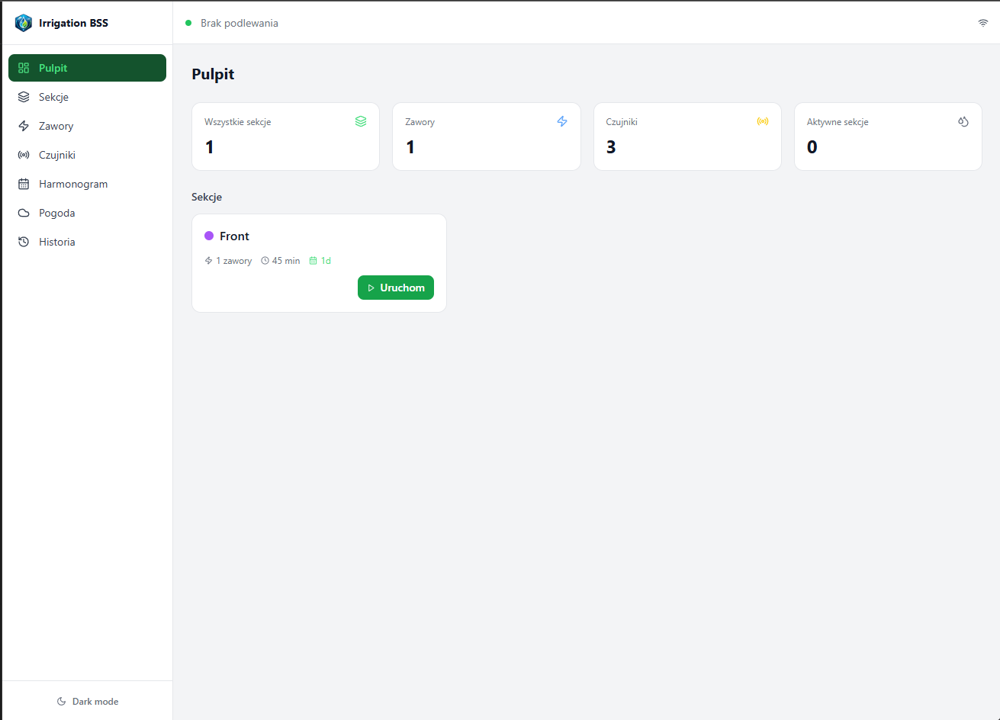
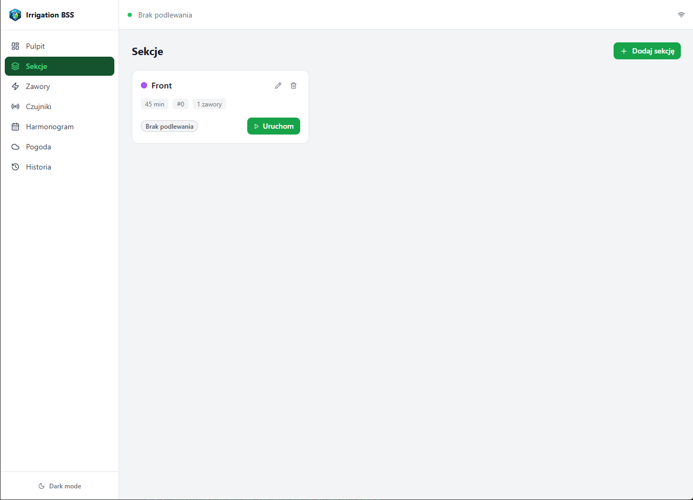
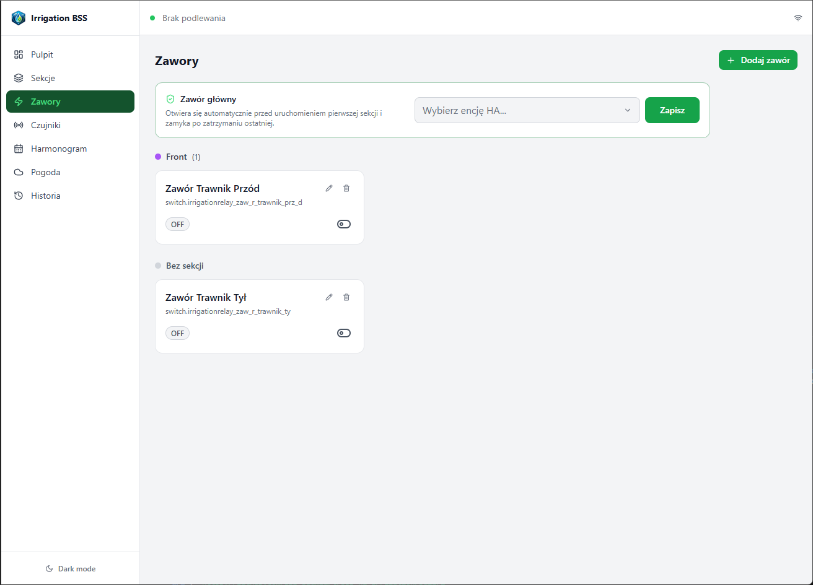
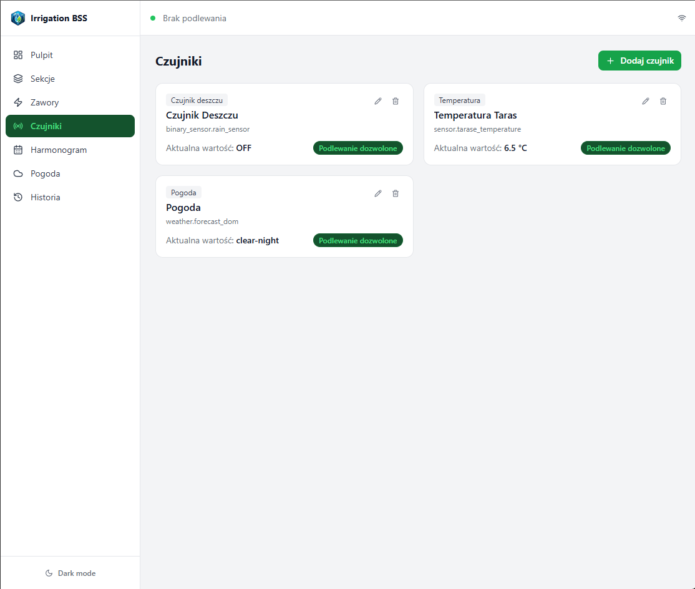
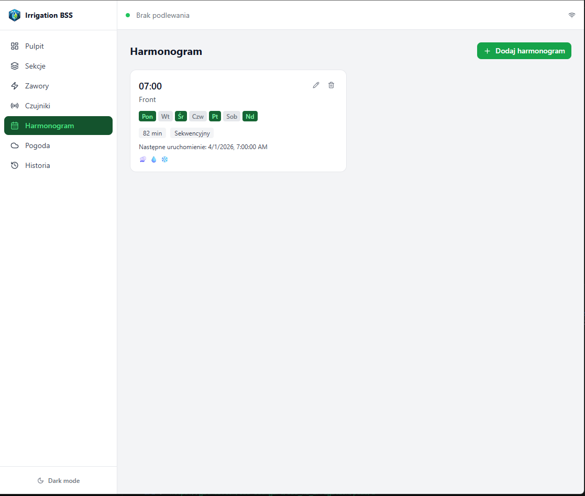

# Irrigation BSS

Advanced irrigation management addon for Home Assistant.

Ten README jest przygotowany dla uzytkownikow Home Assistant, ktorzy chca szybko zrozumiec co robi addon i jak go dodac.

## Co to jest

Irrigation BSS pozwala sterowac podlewaniem ogrodu bezposrednio z panelu Home Assistant.

Najwazniejsze funkcje:

- Sekcje podlewania z przypisanymi zaworami
- Harmonogram tygodniowy (tryb sekwencyjny i rownolegly)
- Szybki start reczny z ustawieniem czasu
- Czujniki blokujace podlewanie (deszcz, wilgotnosc, temperatura)
- Integracja z pogoda i publikacja encji do HA
- Podglad na zywo aktywnej sekcji i czasu pozostalego

## Instalacja (kanal stabilny)

1. W Home Assistant przejdz do Settings -> Add-ons -> Add-on Store.
2. Otworz menu z trzema kropkami i wybierz Custom repositories.
3. Dodaj repozytorium: https://github.com/BSS-Baumgart/bss_ha_irrigation
4. Zainstaluj addon Irrigation BSS.
5. W zakladce Configuration ustaw language i log_level.
6. Uruchom addon.

## Instalacja (kanal testowy develop)

Jesli chcesz testowac nowosci przed release dla userow, dodaj repozytorium z branchem develop:

https://github.com/BSS-Baumgart/bss_ha_irrigation#develop

To jest rekomendowane tylko na osobnej instancji testowej HA.

## Co zobaczy uzytkownik po instalacji

- Sidebar panel Irrigation BSS w Home Assistant
- Widok dashboard z aktywnym podlewaniem i szybkim startem
- Konfiguracje sekcji, zaworow, czujnikow i harmonogramu
- Encje publikowane do HA pod automatyzacje

## Pierwsza konfiguracja

1. Zawory: dodaj encje HA (switch/input_boolean).
2. Sekcje: utworz sekcje i przypisz zawory.
3. Czujniki (opcjonalnie): deszcz, wilgotnosc, temperatura, przeplyw.
4. Harmonogram: ustaw dni, godziny i czas.
5. Dashboard: monitoruj stan i uruchamiaj szybkie akcje reczne.

## Encje publikowane do Home Assistant

| Encja | Typ | Opis |
|------|------|------|
| binary_sensor.irrigation_bss_watering | binary_sensor | Czy jakakolwiek sekcja aktualnie podlewa |
| sensor.irrigation_bss_active_zone | sensor | Nazwa aktywnej sekcji |
| sensor.irrigation_bss_remaining_sec | sensor | Pozostaly czas podlewania w sekundach |
| sensor.irrigation_bss_next_watering | sensor | Najblizsze podlewanie z harmonogramu |
| binary_sensor.irrigation_bss_rain_blocked | binary_sensor | Blokada przez deszcz |
| binary_sensor.irrigation_bss_frost_blocked | binary_sensor | Blokada przez temperature/frost |
| binary_sensor.irrigation_bss_zone_{id} | binary_sensor | Stan konkretnej sekcji |

## Workflow wydań

- Feature branche tworz z develop.
- Merge feature -> develop na testy.
- PR develop -> master tylko pod release.
- Tag i GitHub Release tworz tylko z master.

## Screenshoty UI

Pliki screenshotow wrzucaj do folderu:

docs/screenshots/

Rekomendowane nazwy:

- docs/screenshots/dashboard.png
- docs/screenshots/sections.png
- docs/screenshots/valves.png
- docs/screenshots/sensors.png
- docs/screenshots/schedule.png

Po dodaniu plikow, obrazki beda widoczne ponizej:

## License

MIT
